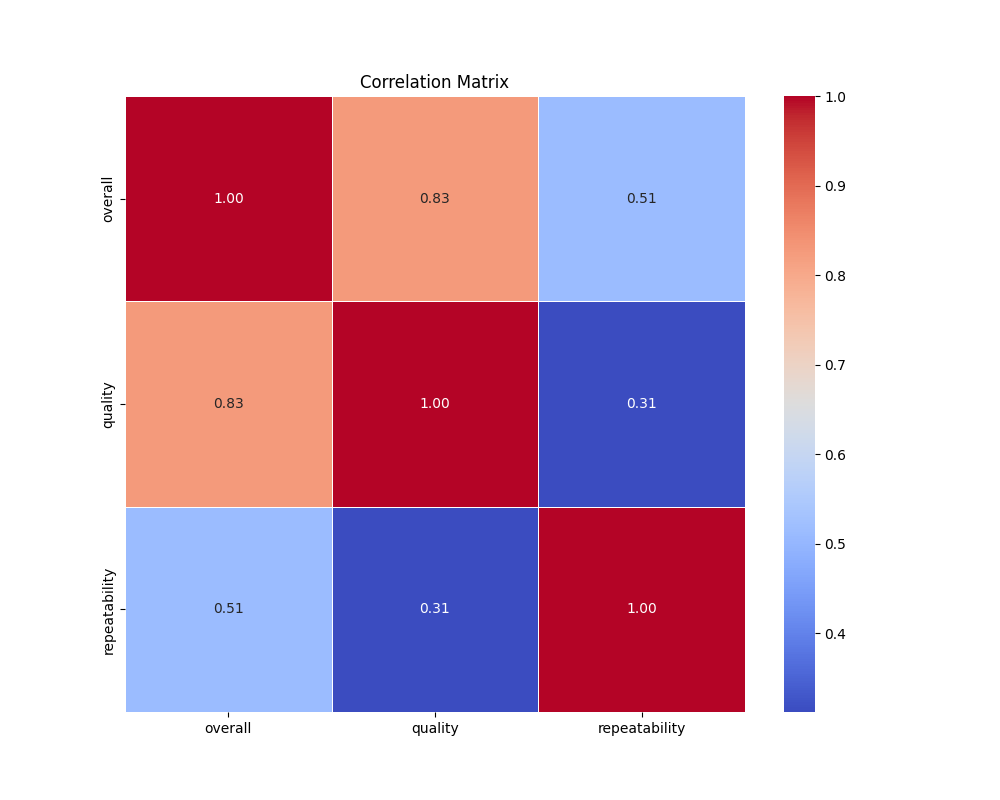
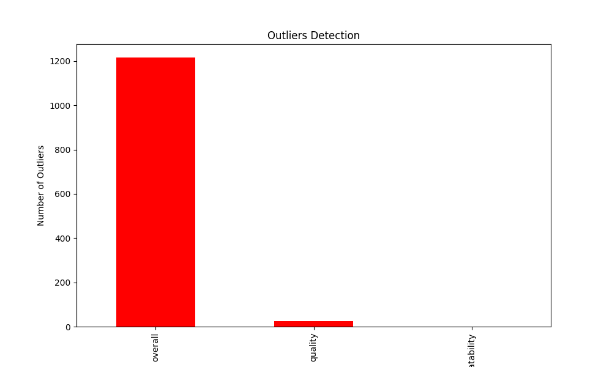

# Automated Data Analysis Report

## Introduction
This is an automated analysis of the dataset, providing summary statistics, visualizations, and insights from the data.

## Summary Statistics
The summary statistics of the dataset are as follows:

| Statistic    | Value |
|--------------|-------|
| overall - Mean | 3.05 |
| overall - Std Dev | 0.76 |
| overall - Min | 1.00 |
| overall - 25th Percentile | 3.00 |
| overall - 50th Percentile (Median) | 3.00 |
| overall - 75th Percentile | 3.00 |
| overall - Max | 5.00 |
|--------------|-------|
| quality - Mean | 3.21 |
| quality - Std Dev | 0.80 |
| quality - Min | 1.00 |
| quality - 25th Percentile | 3.00 |
| quality - 50th Percentile (Median) | 3.00 |
| quality - 75th Percentile | 4.00 |
| quality - Max | 5.00 |
|--------------|-------|
| repeatability - Mean | 1.49 |
| repeatability - Std Dev | 0.60 |
| repeatability - Min | 1.00 |
| repeatability - 25th Percentile | 1.00 |
| repeatability - 50th Percentile (Median) | 1.00 |
| repeatability - 75th Percentile | 2.00 |
| repeatability - Max | 3.00 |
|--------------|-------|

## Missing Values
The following columns contain missing values, with their respective counts:

| Column       | Missing Values Count |
|--------------|----------------------|
| date | 99 |
| language | 0 |
| type | 0 |
| title | 0 |
| by | 262 |
| overall | 0 |
| quality | 0 |
| repeatability | 0 |

## Outliers Detection
The following columns contain outliers detected using the IQR method (values beyond the typical range):

| Column       | Outlier Count |
|--------------|---------------|
| overall | 1216 |
| quality | 24 |
| repeatability | 0 |

## Correlation Matrix
Below is the correlation matrix of numerical features, indicating relationships between different variables:

## Outliers Visualization
This chart visualizes the number of outliers detected in each column:

## Distribution of Data
Below is the distribution plot of the first numerical column in the dataset:

## Conclusion
The analysis has provided insights into the dataset, including summary statistics, outlier detection, and correlations between key variables.
The generated visualizations and statistical insights can help in understanding the patterns and relationships in the data.

## Data Story
Based on the data analysis, here is a creative narrative that interprets the findings in an engaging and detailed manner:

## Story
### The Tale of the Data Guardians

#### Introduction

In a bustling digital realm where numbers danced and patterns emerged, a diverse group of analysts, known as the Data Guardians, embarked on an epic quest. Their mission: to uncover the hidden stories within a vast dataset that held the key to understanding the intricate relationship between overall performance, quality, and repeatability. They gathered in their virtual sanctuary, armed with algorithms and keen insights, ready to illuminate the shadows of data with their findings.

#### Body

As the sun rose over the digital horizon, the Guardians delved into the statistics of their dataset, comprising 2,652 entries, each a unique tale waiting to be told. The average overall score stood at 3.05, hinting at a world of mediocrity peppered with glimpses of excellence. Quality, a close companion to overall performance, boasted an average of 3.21, suggesting that while many were satisfied, there remained a yearning for something greater.

The Guardians noted the spread of these scores—like a painter's palette with colors ranging from the deep shadows of 1 to the bright highlights of 5. With a standard deviation of 0.76 for overall scores, it became clear that while most participants hovered around the average, a few outliers soared or plummeted, creating a rich tapestry of experiences. In their quest for knowledge, they discovered that a staggering 1,216 entries deviated significantly from the norm, each a story of triumph or struggle.

The analysis revealed a fascinating relationship between overall performance and quality, as indicated by a strong correlation coefficient of 0.83. This connection suggested that those who rated higher on quality often found themselves benefiting from more favorable overall assessments. Yet, it was the repeatability metric, with its average of just 1.49, that piqued the Guardians' interest. This figure indicated that many experiences were singular, perhaps fleeting, and not often revisited. The Guardians pondered: what did this mean for the long-term engagement of the participants?

The dataset also revealed a striking absence of data on the creators of these entries, as 262 names were lost to the ether. This lack of attribution left the Guardians questioning the narratives behind the numbers. Who were these creators? What inspired them to share their experiences, and why did some choose to remain anonymous? As they sought answers, they realized that behind every data point lay a story, a heartbeat, and a voice yearning to be heard.

#### Conclusion

As the Data Guardians wrapped up their analysis, they emerged with profound insights and a renewed sense of purpose. The quest revealed that while the average scores suggested a community of moderate satisfaction, the significant number of outliers and the low repeatability rate indicated opportunities for growth and improvement. There was a call to action: to enhance quality and encourage repeat experiences, fostering an environment where voices could be amplified and stories could be revisited.

The Guardians understood that the data was not merely a collection of numbers; it represented lives, dreams, and aspirations. They vowed to share their findings with the world, to bridge the gap between the data and its creators, and to ensure that every future entry would contribute to a more vibrant and engaging narrative.

In the end, the Data Guardians learned that within the realm of numbers, the true magic lay in the stories they told and the connections they forged. Armed with this knowledge, they set forth to inspire others, transforming their findings into a beacon of hope and guidance for those who dared to share their tales in the vast universe of data.
